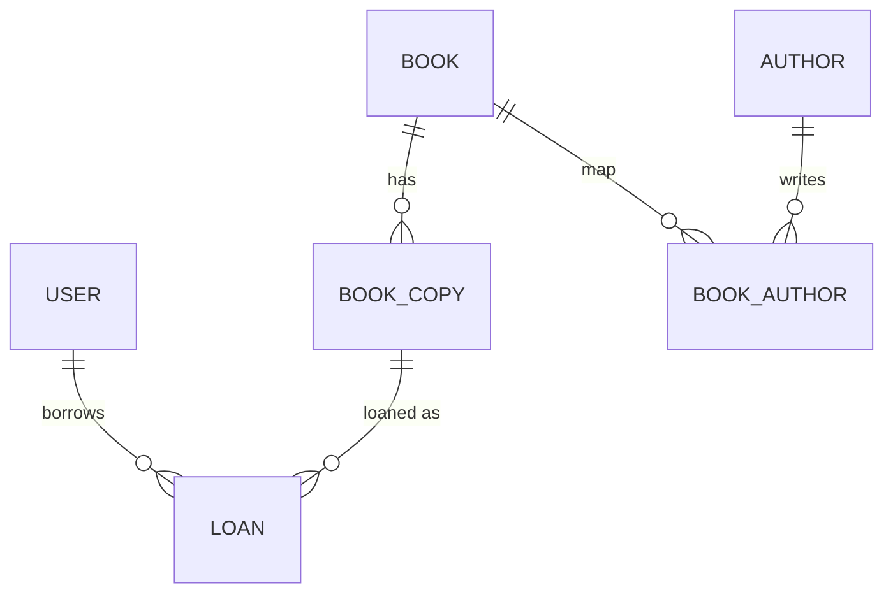

# online-library-db

# Online Library – Database Project - Overview

This project is part of a **modular assignment** within the *Databases* module.  
The aim is to **experience the database design process in practice** – from the ER model and normalization to SQL scripts and sample queries.

---

## Goals
- Design and implementation of a relational database for an **online library**
- Normalization up to **3rd normal form**
- Implementation in SQL (PostgreSQL)
- Documentation and presentation (lecture, quick guide, DB export)

## Database Schema Diagram
- **User** – Persons (students, lecturers, administrators)  
- **Book** – Works with ISBN, title, publisher, category
- **Bookauthor** – Bookauthor
- **Author** – Authors 
- **Category** – Categories/genres  
- **BookCopy** – Physical copies of a book
- **Loan** – Loans (with due date and return date)


## ER Diagram


## Relations
- **user 1**  –> **n loan**
- **book 1**  –> **n bookcopy**
- **book n**  –> **m author** (via bookauthor)
- **book 1**  –> **n loan**

The diagram is saved here: ***[Physical ERD](ERD.png)***

# Online Library – Database Project - Implementation
- Schema file: [sql/schema.sql](sql/schema.sql)
- Sample data: [sql/sample_data.sql](sql/sample_data.sql)
- Queries: [sql/queries.sql](sql/queries.sql)

## CI/CD Pipeline

Workflow File: [.github\workflows\db-ci.yaml](.github\workflows\db-ci.yaml)

A GitHub Actions workflow builds and tests the database on every push on main.
- starts a PostgreSQL service container
- runs schema.sql and sample_data.sql
- executes smoke tests (queries.sql)
- exports a db dump and uploads it in github repo with artifact

## Database Export

The database can be exported using pg_dump:

sample from workflow file: [.github\workflows\db-ci.yaml](.github\workflows\db-ci.yaml)

```bash
pg_dump -U postgres -d online_library_dev -f dump.sql
```

The artifact is uploaded in the pipeline run overview at the bottom:
[ DB Export](db_dump.png)

## Future Improvements
### Security and Flexibility

Currently, database credentials (user, password, database name) are hardcoded in the GitHub Actions workflow.  
As a future improvement, these could be stored in **GitHub Secrets & Variables**:

- **Secrets** (encrypted, hidden): e.g. `POSTGRES_PASSWORD`  
- **Variables** (public, non-sensitive): e.g. `POSTGRES_USER`, `POSTGRES_DB`

### Improve Smoke Tests
Right now, the smoke tests simply run SQL queries and print raw results.  
In the future, they could be made **more readable** by:
- Adding labels (e.g., `Total Books: 5`)  
- Returning test-style outputs (`PASS/FAIL`)  
- Aggregating results into a small summary table

### Organize Database Exports
Currently, dumps are exported as a single file (`dump.sql`).  
Improvements could include:
- Saving dumps inside a dedicated `exports/` folder  
- Separating schema-only (`schema.sql`) and data-only (`data.sql`) dumps  
- Keeping exports versioned per pipeline run

