# online-library-db

# Online Library – Database Project

This project is part of a **modular assignment** within the *Databases* module.  
The aim is to **experience the database design process in practice** – from the ER model and normalization to SQL scripts and sample queries.

---

## Goals
- Design and implementation of a relational database for an **online library**
- Normalization up to **3rd normal form**
- Implementation in SQL (PostgreSQL)
- Documentation and presentation (lecture, quick guide, DB export)

## ER Diagramm
- **User** – Persons (students, lecturers, administrators)
- **Role** – Roles (MEMBER, LIBRARIAN, ADMIN)  
- **Book** – Works with ISBN, title, publisher, category
- **Author** – Authors (n:m relationship to books)
- **Publisher** – Publishers
- **Category** – Categories/genres  
- **BookCopy** – Physical copies of a book
- **Loan** – Loans (with due date and return date)
- **Reservation** – Reservations (queue per book)

```mermaid
erDiagram
  USER ||--o{ LOAN : borrows
  USER ||--o{ RESERVATION : places
  ROLE ||--o{ USER : assigned
  BOOK ||--o{ BOOK_COPY : has
  BOOK ||--o{ BOOK_AUTHOR : has
  AUTHOR ||--o{ BOOK_AUTHOR : writes
  BOOK }o--|| CATEGORY : "belongs to"
  BOOK }o--|| PUBLISHER : "published by"
  BOOK_COPY ||--o{ LOAN : "loaned as"
```

